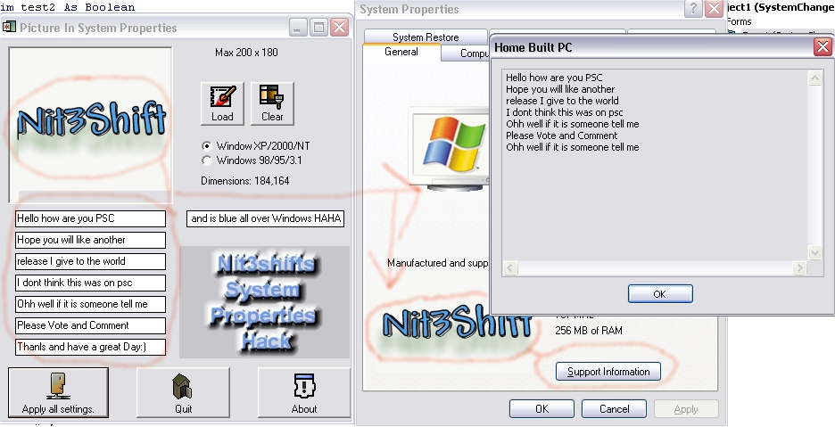



## Computer System Properties Hack \(Very Cool\!\!\)

### Description

Well basically when you right click on your computer and goto to properties, you will find a picture and a blank space or the people that made its logo. Well, this way will change it and the support info.
 
### More Info
 
Wowness...

it might not resize. I have tested this on 98. Tell me if it works.

             |
---                |---
**Submitted On**   |2002-01-06 17:56:54
**By**             |[Josh Nixon](https://github.com/Planet-Source-Code/PSCIndex/blob/master/ByAuthor/josh-nixon.md)
**Level**          |Advanced
**User Rating**    |5.0 (30 globes from 6 users)
**Compatibility**  |VB 3\.0, VB 4\.0 \(16\-bit\), VB 4\.0 \(32\-bit\), VB 5\.0, VB 6\.0
**Category**       |[Miscellaneous](https://github.com/Planet-Source-Code/PSCIndex/blob/master/ByCategory/miscellaneous__1-1.md)
**World**          |[Visual Basic](https://github.com/Planet-Source-Code/PSCIndex/blob/master/ByWorld/visual-basic.md)
**Archive File**   |[Computer\_S46817162002\.zip](https://github.com/Planet-Source-Code/josh-nixon-computer-system-properties-hack-very-cool__1-30469/archive/master.zip)

